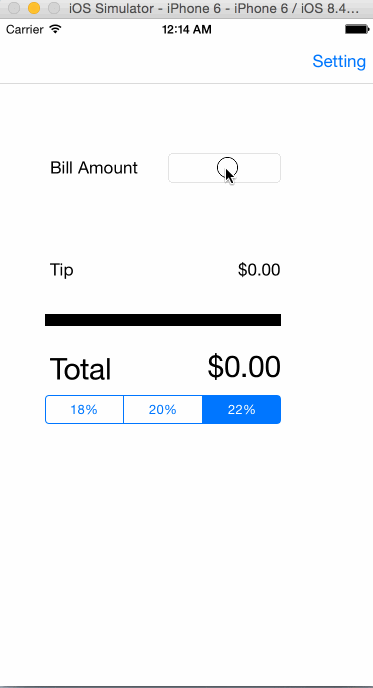

# tips-Tianhe-Wang

This is an iOS demo application for calculating tips

Time spent: 1 hours spent in total

Completed user stories:

 * [x] Required: User can enter a bill amount, choose a tip percentage, and see the tip and total values.
 * [x] Required: Settings page to change the default tip percentage.

GIF created with [LiceCap](http://www.cockos.com/licecap/).
